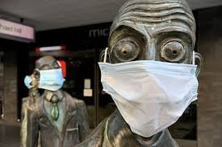
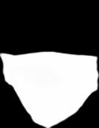
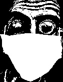
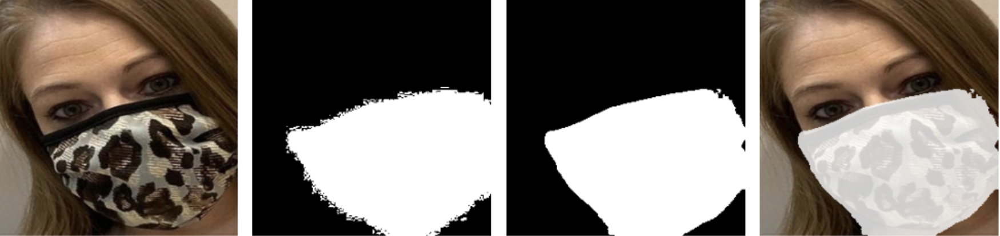
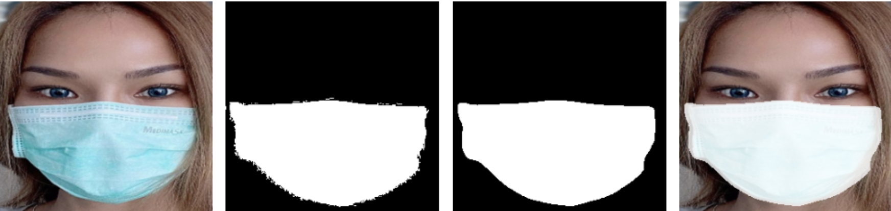

# Mask Detection and Segmentation Project

## 1. Introduction
This project focuses on detecting and segmenting face masks in images using various machine learning and deep learning techniques. The tasks include binary classification using handcrafted features and machine learning classifiers, binary classification using CNNs, region segmentation using traditional techniques, and mask segmentation using U-Net. The objective is to evaluate the performance of different approaches in terms of classification accuracy and segmentation quality.

### Contributors:

(IMT2022022) Nathan <Nathan.Verghese@iiitb.ac.in>

(IMT2022010) Divyam <Divyam.Sareen@iiitb.ac.in>

(IMT2022521) Sarvesh <SarveshKumar.A@iiitb.ac.in>

---

## 2. Dataset
### Source:
https://github.com/chandrikadeb7/Face-Mask-Detection/tree/master/dataset

https://github.com/sadjadrz/MFSD

```
MSFD
├── 1
│   ├── face_crop # face-cropped images of images in MSFD/1/img
│   ├── face_crop_segmentation # ground truth of segmented face-mask
│   └── img
└── 2
    └── img


dataset
├── with_mask # contains images with mask
└── without_mask # contains images without face-mask
```

### Structure:
- *Training Set:* Images used for training the models.
- *Testing Set:* Images used to evaluate model performance.
- *Annotations:* Mask region labels for segmentation tasks.

---

## 3. Objectives

### a. Binary Classification Using Handcrafted Features and ML Classifiers
1. Extract handcrafted features from facial images (Histogram of Oriented Gradients and local binary pattern).
2. Train and evaluate at least two machine learning classifiers (We use XGBoost, Neural Network and SVM) and compare classifier performances based on accuracy.

### b. Binary Classification Using CNN
1. Design and train a Convolutional Neural Network (CNN) for mask classification.
2. Experiment with different hyperparameters (learning rate, batch size, optimizer, activation function).
3. Compare CNN performance with traditional ML classifiers.

### c. Region Segmentation Using Traditional Techniques
1. Apply region-based segmentation methods (e.g., thresholding, edge detection) to segment mask regions, and visualize and evaluate segmentation results.

### d. Mask Segmentation Using U-Net
1. Train a U-Net model to segment the mask regions in facial images.
2. Compare segmentation performance with traditional techniques using IoU or Dice score.

---

## 4. Hyperparameters and Experiments


### Hyperparameters Used in Part B

#### *Model Architecture Hyperparameters*  
| Hyperparameter         | Value              | Description |
|------------------------|-------------------|-------------|
| *Input Image Size*   | (150, 150, 3)     | Each image is resized to *150×150* with *3 channels (RGB)*. |
| *Number of Conv Layers* | 3 | Extracts hierarchical features. |
| *Filter Sizes*       | (3,3) | Kernel size used in Conv layers. |
| *Number of Filters per Layer* | 32 → 64 → 128 | Increasing filters to capture more complex features. |
| *Pooling Layer*      | MaxPooling2D (2×2) | Reduces spatial dimensions. |
| *Activation Function* | ReLU | Introduces non-linearity. |
| *Fully Connected Layer* | Dense(128, activation='relu') | Fully connected hidden layer. |
| *Dropout Rate*       | 0.5 | Prevents overfitting. |
| *Output Layer*       | Dense(1, activation='sigmoid') | Binary classification (mask/no-mask). |

---

#### *Training Hyperparameters*  
| Hyperparameter  | Value | Description |
|----------------|-------|-------------|
| *Optimizer*  | Adam, SGD, RMSprop  |  |
| *Loss Function* | Binary Crossentropy and Crossentropy | Suitable for binary classification. |
| *Metrics*    | Accuracy | Evaluates performance. |
| *Epochs*     | 30 (with Early Stopping) | Number of times model sees the dataset. |
| *Batch Size* | 32/64 | Number of images per batch. |

---

#### *Dataset Splitting Hyperparameters*  
| Hyperparameter  | Value  | Description |
|----------------|--------|-------------|
| *Train Ratio* | 70% | Data used for training. |
| *Validation Ratio* | 15% | Used for tuning hyperparameters. |
| *Test Ratio* | 15% | Used for final model evaluation. |

---

## 5. Results
### Evaluation Metrics:
- *Classification:* Accuracy, Precision, Recall, F1-score
- *Segmentation:* Intersection over Union (IoU), Dice Score

| Model | Accuracy (%) | IoU | Dice Score |
|--------|------------|----|-----------|
| XGBoost (part a) | 95.48% (80-20 train-test split with augmentations) | - | - |
| Neural Network (part a)| 93.69% (80-20 train-test split with augmentations) | - | - |
| SVM (part a)| 92.88% (80-20 train-test split with augmentations) | - | - |
| CNN (part b) | 96.74% Test Accuracy (70-15-15 train-validation-test split)| - | - |
| K-mean clustering | - | 0.554 (mean over 1st 10 images) | 0.414 (mean over 1st 10 images)
| Otsu's Threshold | - | 0.545 (mean over 1st 10 images)|0.404 (mean over 1st 10 images)
| Region-growing| - | 0.129 (mean over 1st 10 images) | 0.082 (mean over 1st 10 images)|
| U-Net Segmentation | 96.03% |90.11% | 94.50% |

---

## 6. Observations and Analysis

### PART A

For each image here we need to make a feature vector. We chose 2 features:  HoG and local binary patterns. 

Since feature vectors corresponding to images may be of different lengths, we resize all images and fix the length of individual sub-feature vectors, so that `np.hstack()` can work without interrupts when all individual sub-feature vectors are combined into one vector for an image. The data used is the dataset. We train an XGBoost model, neural network and SVM, and as observed, the test accuracy of XGBoost is much better. This is attributed to the fact that neural networks need a lot of data to learn.

### PART B


### Project Overview
This project implements a *binary classification* task using a *Convolutional Neural Network (CNN)* to detect whether a person is wearing a face mask or not. The dataset is split into training, validation, and testing sets. Various *hyperparameters* such as batch size, learning rate, optimizer, and activation functions were experimented with to achieve the best performance. The CNN model's performance is then compared with traditional *Machine Learning (ML) classifiers*.

---

### Dataset Preparation
#### Dataset Splitting
- The original dataset consists of two classes: with_mask and without_mask.
- Images are split into *70% training, 15% validation, and 15% testing*.

---

### Model Architecture
A *CNN model* is designed with the following layers:
1. *Convolutional Layers*: Extract spatial features using ReLU activation*.
2. *MaxPooling Layers*: Reduce spatial dimensions to prevent overfitting.
3. *Flatten Layer*: Converts feature maps into a single vector.
4. *Fully Connected (Dense) Layer*: Learns classification features.
5. *Dropout Layer (0.5)*: Reduces overfitting.
6. *Output Layer (Sigmoid Activation)*: Outputs a probability score for binary classification.

---

### Training and Hyperparameter Tuning
- *Batch Size:* 32/64
- *Epochs:* 30 
- *Optimizer:* Adam / SGD / RMSprop
- *Loss Function:* Binary Cross-Entropy
- *Activation Function (Final Layer):* Sigmoid (compared with Softmax, Sigmoid performed better)
- *Data Augmentation:* Experimented but found that training without augmentation gave better results.

### Training Process
- *Initial Weights Saved & Loaded:* Ensuring consistent training across different runs.
- *Validation Set Used:* To monitor generalization.
- *Training Accuracy & Loss Plotted.*

---

### Results & Performance
- *Test Accuracy:* *96.74%*
- *Final Model Saved As:* best_model_partb.pth

---

### Evaluation
- *The CNN model significantly outperformed ML classifiers.*
- *Test accuracy (96.74%)* indicates strong generalization.
- *Further improvements:* More hyperparameter tuning, deeper architectures, and additional data preprocessing.


---

## Conclusion
This project demonstrates the effectiveness of *CNNs for binary classification* in a face mask detection scenario. By tuning hyperparameters and optimizing model architecture, we achieved a high accuracy of *96.74%*, outperforming traditional ML classifiers.


### PART C

3 techniques were used: K-means clustering-based segmentation, Otsu's Thresholding and Region-growing.

For K-means, k=2, one for mask region and another for background.

Here for the choice of the 2 initial centroids, we use domain knowledge. The images are cropped to face-size which implies that it is higly likely that some region of the mask must be in the center of image. 

So we choose one centroid at center and another at the corner.

<p align="center">

  

  
</p>
[Results from K-means and ground truth mask for MSFD/1/000007.jpg]


<p align="center">

  

  
</p>
[Results from Otsu and ground truth mask for MSFD/1/000007.jpg]
<!-- 
<p align="center">
    
  
  
</p>
[Results from K-means and ground truth mask for MSFD/1/000007.jpg] -->


In conclusion:
| K-means | Otsu |
|--------|------------|
| Higher IOU | Lower IOU|
| Higher Dice Score | Lower Dice Score|

Both the algorithms rely on predefined parameters, they do not 'learn' and hence fail to generalise over large datasets (poor mean IoU and Dice scores). Computing mean IoU and Dice for K-means over 8500+ images is computationally expensive, moreover, it is evident from its performance over random samples that its scores won't be significantly better Otsu Thresholding.

---


### PART D


## Introduction
This project focuses on implementing image segmentation techniques using deep learning models, in this case, U-Net. The objective is to segment facial regions accurately and compare the results with traditional techniques.

## Dataset
- *Source*: The dataset used consists of cropped facial images with corresponding ground truth masks.
- *Structure*:
  - face_crop/: Contains input images.
  - face_crop_segmented/: Contains ground truth segmentation masks.
  - output/: Stores results from segmentation techniques.

## Implementation

### *Deep Learning Models*
- *U-Net Architecture*: A powerful fully convolutional network trained for pixel-wise classification.
- *Custom Loss Function*: We initially used accuracy as a loss function but accuracy is not really a good measure to evaluate performance in segmentation tasks. So, we made a custom loss function which combines the binary cross entropy loss with the Dice Loss.
- *Threshold*: We decided to keep a threshold of 0.5 for pixel-wise segmentation.

## Hyperparameters and Experiments
- *U-Net Model*:
  - Optimizer: Adam
  - Learning Rate: 0.0002
  - Batch Size: 4
  - Number of Epochs: 30
  - Loss Function: BCE + Dice Loss

    In this project, we experimented with different hyperparameters to optimize the performance of U-Net models for image segmentation.

## v. Results
- *Evaluation Metrics*:
  - Accuracy
  - Intersection over Union (IoU)
  - Dice Similarity Score


| Model | Accuracy | IoU | Dice Score |
|--------|------------|------|------------|
| U-Net | 0.9603 | 0.9011 | 0.9450 |

As we can see the UNet model works much better than traditional methods

  <p align="center">
  
  
</p>

 <p align="center">
  
  
</p>


## vi. Observations and Analysis
- *Traditional methods* work well for simple segmentation tasks but struggle with complex images.
- *U-Net* outperforms other approaches, providing the highest accuracy and IoU.
- Challenges include dealing with varying lighting conditions, occlusions and noise, which were addressed using preprocessing techniques.

## 7. How to Run the Code
### Setup
1. Clone the repository:
   bash
   git clone https://github.com/DeathlyMade/VR-Project.git
   and then 
   cd VR-Project
   
3. Install dependencies that are required by the notebooks
   
4. Download the dataset from the source specified and put it in required directories
    
5. Run the scripts:

   Note: Parts A and B, as well as Part C and D are in separate notebooks as seen from the directory structure of the project.
   
   They can be run all at once or one at a time to see partial results.

---

## 8. Conclusion
This project demonstrates the effectiveness of deep learning techniques for face mask detection and segmentation. CNN models outperform traditional classifiers for binary classification, while U-Net provides more precise segmentation results. Further improvements can be achieved by using more complex architectures and larger datasets.

---
